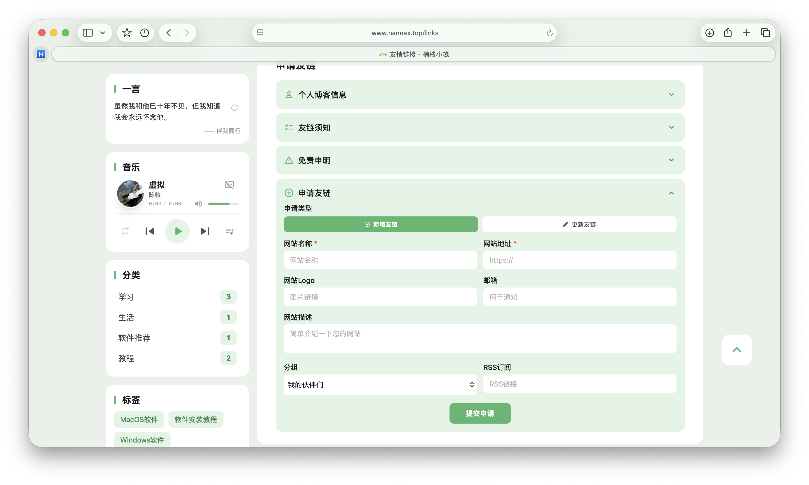

<h1 align="center"> Halo Theme Fuwari  </h1>

---

<div align="center">

一款 [Halo2.0](https://github.com/halo-dev/halo) 的博客主题  
移植于 Astro [fuwari](https://github.com/saicaca/fuwari)同名主题

</div>

<p class="badge-row" align="center">
  <a href="https://halo.run" target="_blank">
    
  </a>
  <a href="https://github.com/AloneNanNan/halo-theme-fuwari-NanNan/releases" target="_blank">
    
  </a>
  <a href="https://github.com/AloneNanNan/halo-theme-fuwari-NanNan/blob/main/LICENSE" target="_blank">

  </a>  </a>
</p>

### 预览：[楠枝小笺](https://www.nannax.top)



本项目在原主题基础上新增以下功能：
#### 1. 适配 Halo 子菜单选项
- 支持导航栏子菜单的展示
- 可在后台设置中配置多级菜单

#### 2. 适配自助提交友链
- 支持访客自助提交友链申请
- 可配置申请按钮的显示/隐藏
- 需安装[自助提交友链](https://www.halo.run/store/apps/app-glejqzwk)插件

#### 3. 适配朋友圈插件
- 可展示友情链接博客的文章，适配主题UI
- 需安装[朋友圈](https://www.halo.run/store/apps/app-yISsV)插件

#### 4. 适配装备管理插件
- 可展示装备信息，适配主题UI
- 需安装[装备管理](https://www.halo.run/store/apps/app-ytygyqml)插件


#### 5. 添加友链页面折叠面板
- **个人博客信息**：展示博主的基本信息，支持一键复制
  - 博客名称、描述、头像、网址、RSS
  - 可配置默认展开/收起
- **友链须知**：展示申请友链的要求说明
  - 可自定义/隐藏卡片
- **免责声明**：展示站点免责声明内容
  - 可自定义/隐藏卡片

#### 6. 添加一言小组件
- 集成 Hitokoto API 随机一言
- 支持点击刷新换一句
- 支持深色模式

#### 7. UI改进
- 添加菜单栏模糊效果
- 添加背景底部波浪效果
----------------------

原项目DEADME：

### 预览：[NanNan's Blog](https://www.jiewen.run/?preview-theme=theme-fuwari-NanNan)


### 安裝

直接通过后台应用市场安装或者下载[releases](https://github.com/AloneNanNan/halo-theme-fuwari-NanNan/releases)，通过 Halo Console 后台主题安装处上传即可。

### 插件支持

Fuwari 主题支持以下 Halo 插件：

- [x] 搜索插件：https://www.halo.run/store/apps/app-DlacW
- [x] 评论插件：https://www.halo.run/store/apps/app-YXyaD
- [x] 瞬间插件：https://www.halo.run/store/apps/app-SnwWD
- [x] 图库插件：https://www.halo.run/store/apps/app-BmQJW
- [x] 链接管理插件：https://www.halo.run/store/apps/app-hfbQg

### 使用说明

> 1、部分功能是使用插件进行支持

- [x] 卡片化设计
- [x] 响应式主题
- [x] 深色模式
- [x] 文章目录
- [x] [代码高亮/语言/复制](https://github.com/halo-sigs/plugin-shiki)（插件）
- [x] [文章搜索](https://github.com/halo-sigs/plugin-search-widget)（插件）
- [x] [评论系统](https://github.com/halo-sigs/plugin-comment-widget)（插件）
- [x] [友情链接](https://github.com/halo-sigs/plugin-links)
- [x] 图库（/photos）：https://halo.run/store/apps/app-BmQJW
- [x] 瞬间（/moments）：https://halo.run/store/apps/app-SnwWD
- [x] 文章目录
- [x] i18n国际化
- [x] 其他功能

### 开发

```bash
cd ~/halo2-dev/themes/theme-fuwari-NanNan
```

```bash
pnpm install
```

```bash
pnpm dev
```

### 🏭 贡献

> 我一个人的时间有限，只是业余有时间写写，如果你想帮助完善 `fuwari` 主题，请：

- 点 `star`
- 提 `issue`
- 修 `bugs`
- 推 `pr`

<br>

### 🙆‍♂️ 感谢

在此感谢以下项目提供的支持：

- [Halo](https://halo.run)
- [Fuwari](https://github.com/saicaca/fuwari)

- [plugin-links](https://github.com/halo-sigs/plugin-links)
- [plugin-comment-widget](https://github.com/halo-sigs/plugin-comment-widget)
- [plugin-search-widget](https://github.com/halo-sigs/plugin-search-widget)
-
- ......

<br>

### QQ交流群

QQ群号（929708466）欢迎大家前来交流分享


### TinyTale Halo2 配套小程序

[TinyTale](https://www.jiewen.run/archives/TinyTale-formal-edition)
基于Halo2.0的小程序，支持文章列表、文章详情、分类列表、图库展示、瞬间展示、评论展示、发布图库、发布瞬间、支持随机图、配套插件等功能。


